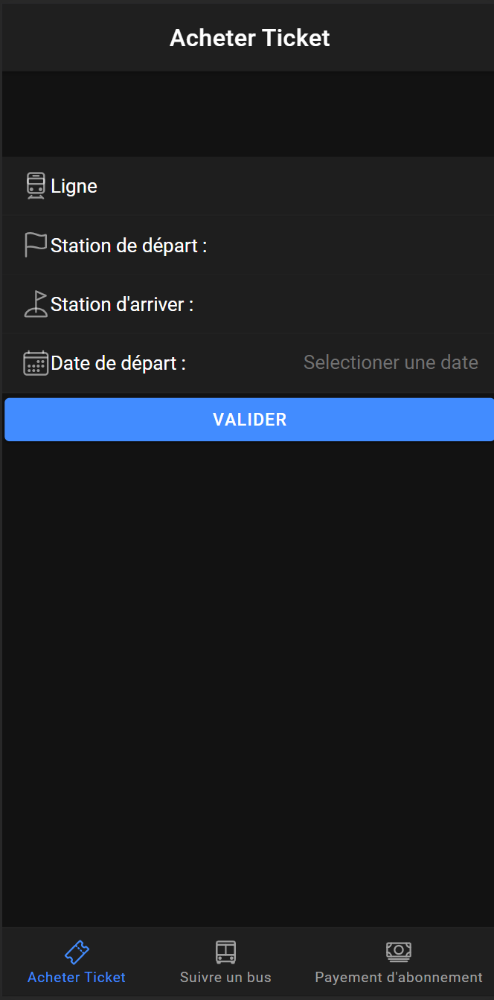
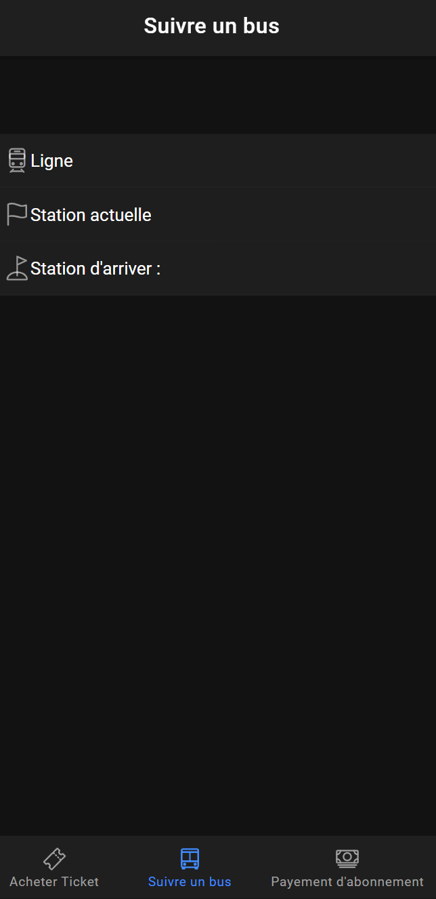
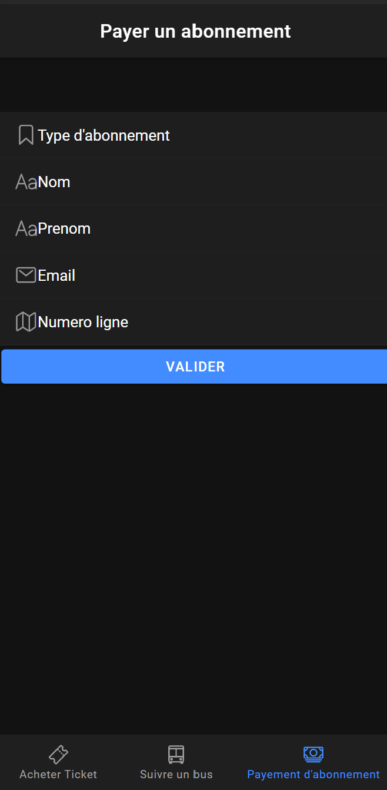

# Introduction
Ceci est la partie front du projet MoovitBus  
## Prérequis et installation :
Il faut tout d'abord installer :  
- **node.js** https://nodejs.org/en/download/  
- **angular** Dans votre invite de commande faite la commande suivante : npm install -g @angular/cli  
- **IONIC** Dans votre invite de commande faite la commande suivante : npm install -g @ionic/cli  
- **Telecharger git** Il faut telecharger git, voici un lien pour le faire : https://git-scm.com/downloads
- **Importer le projet depuis Github** Dans votre console git Bash diriger vous dans le dossier où vous voudriez importer le projet et faite la commande suivante : git clone https://github.com/aliBarakate/MoovitbusFront.git  
- **Démarrer l'application sur votre machine** Pour le faire, sur votre console rendez-vous à la racine du projet et faite la commande suivante : ionic serve
## Dossier Google Drive qui contient la structure de tout les fichiers JSON  
- Vous trouverez sur ce lien la structure de tout les fichiers JSON https://drive.google.com/drive/folders/1ExgHcXTY5Bfh3uLgqS2dQ1Npj9kHHXMA?usp=sharing
# Répartition des tâches :  
- **Ayoub** : Page = tab1:Acheter ticket => alimenter la page par json  
- **Ali** : dévelopement de l'application IONIC  
- **Hassan** : crée la page Login et  request post  
- **Imane** : crée la page inscription et  request post  
- **Marouan** : crée la page S'inscrire dans un abonnement et traiter les requetes GET/POST  
- **Siham** : Page = tab3:payement d'abonnement => alimenter la page par json.  
- **Yasser** : Page = tab2:Suivre un bus => alimenter la page par json.  

# Structure du code et acheminement des tâches :  
### Acheter un ticket  

Cette partie, dont se chargera Ayoub, est régie par le component tab1 dans src    

### Suivre un bus  

Cette partie, dont se chargera Yasser, est régie par le component tab2 dans src  

### Payement d'abonnement  

Cette partie, dont se chargera Siham, est régie par le component tab3 dans src  